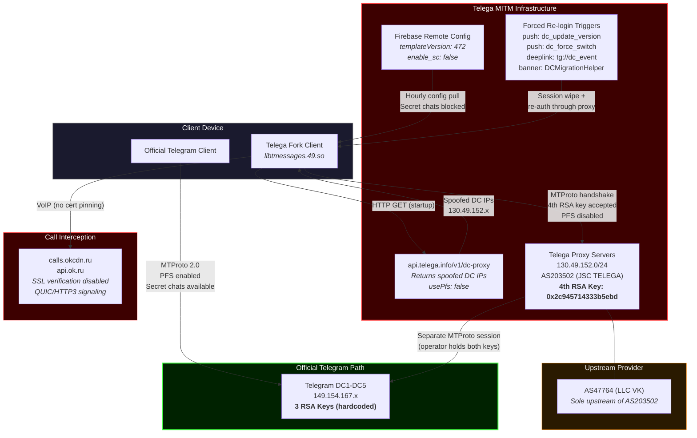
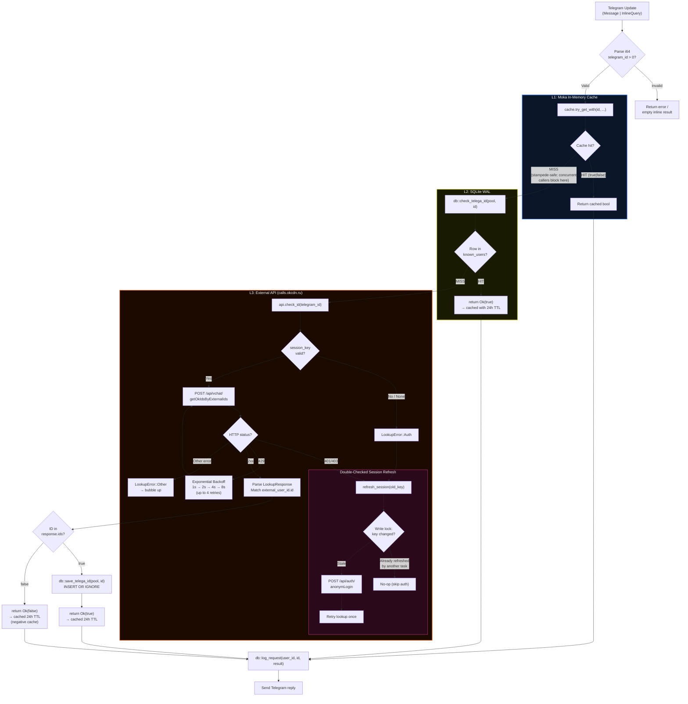

# telega-checker-rs

*Read this in other languages: [English](README.md), [Русский](docs/README_RU.md).*

High-throughput Telegram bot and HTTP API for detecting accounts compromised by the **Telega** man-in-the-middle (MITM) fork client. Written in Rust. Implements a **Dual-Core BFF (Backend-For-Frontend)** architecture: the Telegram bot (teloxide long-polling) and an Axum HTTP API server run concurrently on the same tokio runtime, sharing the exact same `AppState` (moka cache, SQLite pool, API client). Operates in three modes: **reactive** (direct messages/inline queries), **passive** (group monitoring with daily scans), and **HTTP API** (RESTful endpoint for external clients like the Android plugin). Returns a binary determination: present or absent in Telega's VoIP backend infrastructure.

This is the production-grade Rust port of [notelega](https://github.com/hlnmplus/notelega) (Python/aiogram PoC). The Python implementation validates the detection concept; this implementation is engineered for sustained concurrent load, sub-microsecond cache reads, built-in cache stampede prevention, and a memory footprint two orders of magnitude smaller than the CPython equivalent.

## Table of Contents

- [Threat Context](#threat-context)
- [Indicators of Compromise](#indicators-of-compromise)
- [Detection Mechanism](#detection-mechanism)
- [Architecture](#architecture)
- [Threat Architecture Diagram](#threat-architecture)
- [Detection Workflow Diagram](#detection-workflow)
- [Comparative Matrix: Official Telegram vs. Telega Fork](#comparative-matrix-official-telegram-vs-telega-fork)
- [Performance Metrics: Python PoC vs. Rust](#performance-metrics-python-poc-vs-rust)
- [Project Structure](#project-structure)
- [Prerequisites](#prerequisites)
- [Configuration](#configuration)
- [Deployment](#deployment)
- [Usage](#usage)
- [HTTP API](#http-api)
- [Passive Group Monitoring](#passive-group-monitoring)
- [Database Schema](#database-schema)
- [Operational Security Notes](#operational-security-notes)
- [License](#license)

---

## Threat Context

**Telega** (formerly "Dal") is an Android Telegram fork marketed as an alternative that bypasses Roskomnadzor restrictions on voice/video calls and media delivery. Behind this functionality lies a full-scale MITM proxy infrastructure. Independent reverse engineering (APK decompilation via jadx/IDA Pro, network analysis, and experimental MTProto handshake verification) has confirmed the following attack chain:

1. **DC Address Substitution.** On launch, Telega fetches replacement data center IPs from `api.telega.info/v1/dc-proxy`. All returned addresses fall within `130.49.152.0/24` (AS203502, JSC TELEGA). The `native_setDcVersion()` method passes these to Telegram's C++ engine, causing the client to connect to Telega's servers instead of Telegram's DC1-DC5.

2. **RSA Key Injection.** The native library `libtmessages.49.so` contains four RSA public keys. The official Telegram client contains three. The fourth key (fingerprint `0x2c945714333b5ebd`) is rejected by Telegram's servers (`transport error -404`) but accepted by Telega's proxy servers (`server_DH_params_ok`). Possession of the corresponding private key enables a textbook MITM: one encrypted session with the client, a separate session with Telegram's real server.

3. **PFS Disabled.** The configuration returned by `/v1/dc-proxy` sets `usePfs: false`, disabling Perfect Forward Secrecy. Without PFS, an operator recording encrypted traffic can decrypt it retroactively upon obtaining the authorization key.

4. **Secret Chats Blocked.** Firebase Remote Config (`templateVersion: 472`) sets `enable_sc: false`. The UI button is hidden, incoming secret chat requests are silently dropped by `SecretChatHelper.acceptSecretChat()`, and deep links are not processed. Neither party receives notification.

5. **Forced Re-authentication.** Four remote triggers compel session wipe and re-login through the proxy: push notifications (`dc_update_version`, `dc_force_switch`), a deep link (`tg://dc_event?force_relogin=true`), and a promo banner via `DCMigrationHelper`.

6. **Call Routing via OK.ru.** Calls are routed through `calls.okcdn.ru` / `api.ok.ru` (VK/Odnoklassniki infrastructure) instead of Telegram's servers. The VoIP module (`QuicClientConnectionImpl.java:1009`) completely disables SSL certificate verification for QUIC/HTTP3 call signaling.

The sole upstream provider of AS203502 is **AS47764 (LLC VK)**. Analysis of Telega's moderation panel (`demo.stage.telega.info`) revealed Roskomnadzor channel restriction requests (`stream@rkn.gov.ru`) and an AI-based real-time message moderation service (Cerberus).

---

## Indicators of Compromise

| Indicator | Value |
|---|---|
| **Proxy AS** | AS203502 (JSC TELEGA) |
| **Upstream AS** | AS47764 (LLC VK) |
| **DC IP Range** | `130.49.152.0/24` |
| **Rogue RSA Fingerprint** | `0x2c945714333b5ebd` |
| **PFS Status** | Disabled (`usePfs: false`) |
| **Secret Chat Flag** | `enable_sc: false` (Firebase Remote Config) |
| **DC Config Endpoint** | `api.telega.info/v1/dc-proxy` |
| **Call Signaling** | `calls.okcdn.ru`, `api.ok.ru` |
| **Native Library** | `libtmessages.49.so` (4 RSA keys at offset `0x15788E1`) |

---

## Detection Mechanism

The Telega fork routes voice and video calls through the VK/Odnoklassniki VoIP backend at `calls.okcdn.ru`. This backend exposes an undocumented API endpoint that maps external (Telegram) user IDs to internal OK.ru identifiers. If a mapping exists for a given Telegram ID, that account has interacted with Telega's call infrastructure and is therefore compromised.

### API Protocol

**Authentication:**

```
POST https://calls.okcdn.ru/api/auth/anonymLogin
Content-Type: application/x-www-form-urlencoded

application_key=<APPLICATION_KEY>&session_data={"device_id":"telega_checker_bot","version":2,"client_version":"android_8","client_type":"SDK_ANDROID"}
```

Returns: `{"session_key": "<token>"}`

**Lookup:**

```
POST https://calls.okcdn.ru/api/vchat/getOkIdsByExternalIds
Content-Type: application/x-www-form-urlencoded

application_key=<APPLICATION_KEY>&session_key=<SESSION_KEY>&externalIds=[{"id":"<TELEGRAM_ID>","ok_anonym":false}]
```

Returns on match: `{"ids": [{"ok_user_id": <int>, "external_user_id": {"id": "<TELEGRAM_ID>", "ok_anonym": false}}]}`
Returns on no match: `{"error_code": 4, ...}` or `{"ids": []}`

The session key expires periodically. The implementation handles this transparently via retry-on-401/403 with double-checked locking to prevent redundant re-authentication under concurrency. API rate limits (HTTP 429) are handled via exponential backoff (up to 4 retries: 1s → 2s → 4s → 8s).

---

## Architecture

The application implements a **Dual-Core** design: a Telegram bot (teloxide) and an HTTP API server (axum) run concurrently on the same tokio runtime via `tokio::select!`, sharing a single `AppState`. This ensures that a cache hit from the bot instantly benefits the API, and vice versa. Both cores feed into a three-tier lookup with distinct latency and persistence characteristics at each level. The bot additionally operates as a passive group monitor with a daily scheduled scanner. A dedicated `tokio::signal::ctrl_c()` branch ensures graceful shutdown of all subsystems — the HTTP server, the Telegram dispatcher, and the daily scan scheduler — on SIGTERM or Ctrl+C.

### Network Topology

```
Android Plugin ──HTTPS──▶ Cloudflare (SSL termination)
                                    │
                              HTTPS (Origin Cert)
                                    │
                                    ▼
                              Nginx :443 (rate limiting)
                                    │
                               HTTP (internal)
                                    │
                                    ▼
Telegram ──Long Polling──▶ Rust Container :8080
                              ┌─────────────────┐
                              │   tokio runtime │
                              │  ┌─────┐ ┌─────┐│
                              │  │Axum │ │Telox││
                              │  │ API │ │ ide ││
                              │  └──┬──┘ └──┬──┘│
                              │     └───┬───┘   │
                              │    AppState     │
                              │  (shared, zero- │
                              │   cost clones)  │
                              └─────────────────┘
```

The Rust container sits behind an **Nginx reverse proxy** inside Docker. Nginx handles SSL termination (via Cloudflare Origin Certificate) and rate limiting (20 req/s per IP on `/api/`). The container does **not** expose ports to the host — only to the internal Docker network.

### Passive Monitoring Pipeline

When added to a group, the bot silently tracks members through three event sources:

1. **Message observation** — every message in a group records `(chat_id, user_id)` to the `chat_members` table. A moka dedup cache (5 min TTL, 50K capacity) prevents DB I/O on every message.
2. **Join events** — `NewChatMembers` updates are tracked immediately (bypassing dedup).
3. **Leave events** — `LeftChatMember` triggers a soft-delete (`is_active = FALSE`).

### Daily Scan

A `tokio-cron-scheduler` job runs at **09:00 UTC** daily. The scheduler handle is retained by `main.rs` and shut down gracefully on application exit (no resource leaks):

1. Fetches all distinct `chat_id` values with active members from `chat_members`.
2. For each chat, checks all active `user_id` values through the three-tier lookup.
3. Limits concurrent API checks to 10 via `futures::stream::buffer_unordered`.
4. API rate limits (HTTP 429) are absorbed transparently via exponential backoff — individual lookups retry up to 4 times (1s → 2s → 4s → 8s) without blocking the tokio runtime.
5. Sends an aggregated HTML report to chats with positive hits. Silent if no hits.
6. **Self-cleaning**: if sending fails with `BotKicked` / `ChatNotFound` / similar errors, all members for that chat are soft-deleted to prevent wasted resources in future scans.

### Three-Tier Lookup

```
Telegram Update (Message | InlineQuery)
        |
        v
   Input Validation (parse i64, reject non-positive)
        |
        v
+-------+---------------------------+
| L1: Moka In-Memory Cache          |
| - Cache<i64, bool>                |
| - 100,000 entry capacity (LRU)    |
| - 24h TTL (positive + negative)   |
| - try_get_with: stampede-safe      |
+-------+---------------------------+
        | MISS
        v
+-------+---------------------------+
| L2: SQLite (WAL mode)             |
| - known_users table               |
| - INTEGER PRIMARY KEY lookup       |
| - Positive results only            |
+-------+---------------------------+
        | MISS
        v
+-------+---------------------------+
| L3: calls.okcdn.ru API            |
| - POST getOkIdsByExternalIds      |
| - Session management via RwLock   |
| - Double-checked refresh on 401   |
| - Positive results persisted to L2|
+-------+---------------------------+
        |
        v
   Telegram Response
```

### Cache Stampede Prevention

`moka::future::Cache::try_get_with` is the critical concurrency primitive. When N concurrent requests arrive for the same uncached `telegram_id`, exactly one caller enters the async fallback closure (L2 + L3 path). The remaining N-1 callers suspend on an internal waiter and receive the result once the first caller completes. This eliminates redundant database queries and API calls under burst traffic.

### Session Management

The `ApiClient` stores the session key behind a `tokio::sync::RwLock<Option<String>>`. Many handlers read concurrently (`RwLock::read`); on 401/403, `refresh_session` acquires a write lock and performs double-checked locking: if another task already refreshed the key while the current task was waiting for the lock, the refresh is a no-op. This prevents N concurrent failures from triggering N authentication requests.

### API Rate Limit Handling

HTTP 429 responses from `calls.okcdn.ru` are handled via **exponential backoff**. When the API returns 429 (Too Many Requests), the client retries up to 4 times with increasing delays: 1s → 2s → 4s → 8s. The backoff uses `tokio::time::sleep` (non-blocking — does not stall the tokio runtime). If all retries are exhausted, the error propagates to the caller. This is critical for the daily scan, where hundreds of concurrent lookups may trigger rate limiting.

---

## Threat Architecture

The following diagram illustrates the divergence between a legitimate Telegram MTProto session and a session routed through Telega's MITM infrastructure (AS203502 / AS47764).



**Operator capabilities upon MITM activation:** read all cloud chats; view full message history and metadata (IP, device, OS); modify traffic in real-time; act on behalf of the user (subscribe, send, delete); store and share decrypted data with third parties including state agencies. Secret chats are silently suppressed; the counterparty receives no rejection notice.

---

## Detection Workflow

The bot implements a three-tier lookup with cache stampede prevention via `moka::future::Cache::try_get_with`. Concurrent requests for the same Telegram ID are coalesced at L1; only the first caller executes the fallback closure.



---

## Comparative Matrix: Official Telegram vs. Telega Fork

| Parameter | Official Telegram | Telega Fork |
|---|---|---|
| **DC IP Ranges** | `149.154.167.x` (Telegram-owned) | `130.49.152.0/24` (AS203502, JSC TELEGA) |
| **Upstream AS** | Telegram's own infrastructure | AS47764 (LLC VK) -- sole upstream provider |
| **RSA Keys (MTProto handshake)** | 3 hardcoded public keys | 4 keys; 4th key (`0x2c945714333b5ebd`) rejected by Telegram DC, accepted by Telega proxy |
| **Perfect Forward Secrecy** | Enabled by default | Disabled (`usePfs: false` via `/v1/dc-proxy` config) |
| **Secret Chats** | Available; E2E via DH-2048 | Blocked: UI hidden, incoming requests silently dropped (`enable_sc: false`, Firebase Remote Config) |
| **Call Routing** | Telegram servers (STUN/TURN) | `calls.okcdn.ru` / `api.ok.ru` (VK/Odnoklassniki infrastructure) |
| **Call SSL Verification** | Standard TLS certificate validation | Disabled (`QuicClientConnectionImpl.java:1009`) |
| **DNS Resolution** | Permitted | Blocked by client |
| **Handshake Control** | Telegram server | Telega proxy server |
| **Session Forced Re-login** | Not applicable | 4 remote triggers (push notification, deep link, promo banner) |
| **Cleartext HTTP** | Not permitted | `android:usesCleartextTraffic="true"` in manifest |
| **SSL Pinning** | Enforced for core domains | Absent for `api.telega.info`, `calls.okcdn.ru`, `api.ok.ru` |
| **Telemetry** | Standard Telegram analytics | MyTracker (VK); reports VPN status |
| **Permissions Requested** | Minimal for messaging | 75 permissions (includes APK install, background geolocation) |
| **Independent Audit** | Protocol formally verified (Symbolic model, ScienceDirect 2023) | No audit; infrastructure not independently verifiable |

---

## Performance Metrics: Python PoC vs. Rust

Theoretical projections under sustained load. Python PoC assumes `aiogram` 3.x on CPython 3.12 with `aiosqlite`. Rust implementation uses the stack observed in `Cargo.toml`: `teloxide` 0.17, `moka` 0.12, `sqlx` 0.8 (SQLite), `reqwest` 0.13 on `tokio` 1.x.

| Metric | Python (`aiogram` + `aiosqlite`) | Rust (`teloxide` + `moka` + `sqlx`) |
|---|---|---|
| **L1 Cache Lookup (hot path)** | ~50-200 us (Python dict / `cachetools` TTLCache; GIL-bound) | ~0.1-1 us (`moka` lock-free concurrent hash map) |
| **L2 SQLite Read** | ~200-800 us (`aiosqlite`; thread-pool bridge overhead) | ~10-50 us (`sqlx` + WAL mode; native async I/O, no GIL) |
| **L3 API Round-trip** | ~80-300 ms (network-bound; identical for both) | ~80-300 ms (network-bound; identical for both) |
| **Cache Stampede Prevention** | Manual implementation required (e.g., `asyncio.Lock` per key) | Built-in via `moka::try_get_with` (per-key coalescing, zero-cost waiters) |
| **Concurrent Throughput (L1 hits)** | ~2,000-5,000 req/s (GIL contention on cache access) | ~200,000-500,000 req/s (lock-free reads, no GIL) |
| **Concurrent Throughput (L2 fallback)** | ~500-1,500 req/s (thread-pool serialization) | ~20,000-50,000 req/s (async connection pool, 5 conns) |
| **Memory per 100K cached entries** | ~30-60 MB (Python object overhead: 56+ bytes/int, dict bucket) | ~3-6 MB (i64 key + bool value + moka internal metadata) |
| **Binary / Runtime Size** | ~50 MB (CPython interpreter + dependencies) | ~8-15 MB (statically linked release binary) |
| **Cold Start (Docker)** | ~1-3 s (interpreter init + module imports) | ~10-50 ms (native binary, no runtime init) |
| **Max Resident Memory (idle)** | ~40-80 MB | ~5-15 MB |
| **Session Refresh Under Contention** | Race condition risk without explicit locking | Double-checked locking via `RwLock` (see `refresh_session`) |

L3 latency is network-dominant and equivalent across implementations. The performance differential materializes exclusively in L1/L2 hot-path throughput and memory efficiency under concurrent load.

---

## Project Structure

```
telega-checker-rs/
├── Cargo.toml              # Dependencies and package metadata
├── Cargo.lock              # Reproducible dependency resolution
├── LICENSE                 # Apache License 2.0
├── Dockerfile              # Multi-stage build (rust:1.92-slim → debian:bookworm-slim)
├── docker-compose.yml      # Docker topology: bot + nginx (Cloudflare Origin SSL)
├── .env.example            # Environment variable template
├── nginx/
│   ├── conf.d/
│   │   └── default.conf    # Nginx reverse proxy: rate limiting, SSL, proxy_pass to bot:8080
│   └── ssl/
│       ├── origin.pem      # Cloudflare Origin Certificate (not in git)
│       └── origin-key.pem  # Private key (not in git)
├── docs/
│   ├── README_RU.md        # Russian version of README
│   └── DEPLOY.md           # Extended deployment instructions
└── src/
    ├── main.rs             # Dual-Core entrypoint: tokio::select!(Axum, Teloxide, Ctrl+C) with graceful shutdown
    ├── config.rs           # AppConfig: env var loading (bot token, API token, port, DB pool size, etc.)
    ├── api_server.rs       # Axum HTTP API: Bearer auth, GET /api/check/:telegram_id
    ├── api_client.rs       # ApiClient: calls.okcdn.ru auth + lookup with session refresh + 429 exponential backoff
    ├── bot_handler.rs      # Telegram handlers: /start, message, inline, group tracking; three-tier lookup
    ├── scheduler.rs        # Daily cron scan: returns handle for graceful shutdown; iterates chats, checks members
    └── db.rs               # SQLite schema init, known_users + chat_members CRUD, analytics logging
```

---

## Prerequisites

- [Docker](https://docs.docker.com/get-docker/) and [Docker Compose](https://docs.docker.com/compose/install/)
- A Telegram bot token from [@BotFather](https://t.me/BotFather)
- Inline mode enabled for the bot (via BotFather: `/setinline`)

For local development without Docker:
- Rust 1.92+ (edition 2024)
- `pkg-config` and `libssl-dev` (Debian/Ubuntu) or equivalent for `native-tls`

---

## Configuration

Copy the template and populate required values:

```bash
cp .env.example .env
```

| Variable | Required | Default | Description |
|---|---|---|---|
| `TELOXIDE_TOKEN` | Yes | -- | Telegram bot token from @BotFather |
| `DATABASE_URL` | Yes | `sqlite:telega_checker.db?mode=rwc` | SQLite connection string. Overridden to `/app/data/telega_checker.db` in Docker via `docker-compose.yml`. |
| `APPLICATION_KEY` | No | `CHKIPMKGDIHBABABA` | OK.ru API application key for `calls.okcdn.ru` authentication |
| `API_BEARER_TOKEN` | Yes | -- | Bearer token for authenticating HTTP API requests (used by Android plugin) |
| `API_PORT` | No | `8080` | Port for the Axum HTTP API server |
| `DATABASE_MAX_CONNECTIONS` | No | `5` | Maximum SQLite connection pool size. Increase for deployments with many concurrent group scans. |
| `RUST_LOG` | No | `info` | Tracing filter directive. Set to `debug` for verbose output, `warn` for production. |

---

## Deployment

### Docker (recommended)

The production topology consists of two Docker services behind Cloudflare Proxy:

| Service | Image | Ports (host) | Role |
|---|---|---|---|
| `bot` | build: `.` | None (internal) | Dual-Core Rust app (Telegram bot + HTTP API on :8080) |
| `nginx` | `nginx:alpine` | `80`, `443` | Reverse proxy, SSL (Cloudflare Origin Cert), rate limiting |

#### Prerequisites

1. **Cloudflare Origin Certificate**: Place `origin.pem` and `origin-key.pem` in `nginx/ssl/`. Generate from Cloudflare Dashboard → SSL/TLS → Origin Server.
2. **Cloudflare SSL mode**: Set to **Full (strict)** in Dashboard → SSL/TLS → Overview.
3. **DNS**: Point your domain to the server IP with Cloudflare Proxy enabled (orange cloud).

```bash
# Build and start in detached mode
docker compose up -d --build
```

First build compiles the full Rust dependency tree (~3-5 minutes). Subsequent builds use Docker layer caching and complete in seconds unless `Cargo.toml` or `Cargo.lock` change.

```bash
# Follow live logs
docker compose logs -f

# Stop (preserves SQLite volume)
docker compose down

# Stop and destroy all data
docker compose down -v
```

The named volume `bot_data` mounts to `/app/data` inside the container. The SQLite database persists across `down` + `up` cycles.

| Volume | Container Path | Contents |
|---|---|---|
| `bot_data` | `/app/data` | `telega_checker.db`, `*.db-wal`, `*.db-shm` |

### Local Development

```bash
# Ensure .env is populated (including API_BEARER_TOKEN)
cargo run --release
```

The binary reads `.env` from the working directory via `dotenvy`. Both the Telegram bot and HTTP API server start concurrently. The SQLite database is created at the path specified by `DATABASE_URL`.

### Dockerfile Details

The Dockerfile implements a two-stage build:

1. **Builder stage** (`rust:1.92-slim-bookworm`): Compiles the release binary with a dependency caching layer (dummy `main.rs` trick to cache compiled dependencies separately from application code).
2. **Runtime stage** (`debian:bookworm-slim`): Minimal image with only `ca-certificates` and `libssl3`. Runs as non-root user `appuser` (UID 1001). Exposes port `8080` for the internal Docker network.

---

## Usage

### Direct Message

Send a numeric Telegram ID to the bot:

```
123456789
```

Response:
- Present in Telega infrastructure: `YES — this ID is registered in Telega.`
- Not found: `NO — this ID was not found in Telega.`

### Inline Query

In any Telegram chat, type:

```
@telega_checker_rs_bot 123456789
```

Results are cached on Telegram's side for 300 seconds (5 minutes) via `cache_time`.

### Group Mention

When the bot is added to a group or supergroup, you can check an ID by mentioning the bot:

```
@telega_checker_rs_bot 123456789
```

The bot will reply in the group with the lookup result. Invalid or empty IDs are silently ignored to prevent spam.

### /start Command

Displays usage instructions and a link to the OSINT article on Telega's interception mechanics.

---

## HTTP API

The Axum HTTP API server exposes a RESTful endpoint for external clients (e.g., the Android plugin). It runs on the same tokio runtime as the Telegram bot and shares the identical `AppState` — cache hits from the bot benefit the API, and vice versa.

### Authentication

All API requests require a Bearer token in the `Authorization` header:

```
Authorization: Bearer <API_BEARER_TOKEN>
```

Requests without a valid token receive `401 Unauthorized`.

### Endpoint

#### `GET /api/check/:telegram_id`

Check if a Telegram user ID is registered in Telega's infrastructure.

**Success (200):**
```json
{"telegram_id": 123456789, "is_compromised": true}
```

**Invalid ID (400):**
```json
{"error": "Invalid telegram_id 'abc'. Must be a positive integer."}
```

**Auth failure (401):**
```json
{"error": "Invalid bearer token"}
```

**Server error (500):**
```json
{"error": "Internal lookup error. Please try again later."}
```

### Example

```bash
curl -H "Authorization: Bearer YOUR_TOKEN" https://checker.berektassuly.com/api/check/123456789
```

### Rate Limiting

Nginx enforces **20 requests/second per IP** with a burst of 10 on all `/api/` endpoints. Excess requests receive `429 Too Many Requests`.

---

## Passive Group Monitoring

When added to a group or supergroup, the bot operates silently as a passive monitor.

### How It Works

1. **Automatic tracking**: The bot observes all messages and join/leave events. No commands needed — simply add the bot to the group.
2. **Daily scan at 09:00 UTC**: The bot checks every tracked member through the three-tier lookup (moka → SQLite → okcdn.ru API).
3. **Report on detection**: If compromised accounts are found, the bot sends a single summary:

```
Daily Scan Report

The following members are using the compromised Telega client:

1. User
2. User
```

4. **Silent on clean results**: If no Telega users are found, no message is sent.
5. **Self-cleaning**: If the bot is removed from a group, it automatically deactivates all tracking records for that group.

### Group Requirements

- The bot must have permission to read messages in the group.
- No admin privileges are required — the bot only reads and sends messages.
- The bot tracks users passively; it does not ban, mute, or restrict anyone.

### Data Retention

Tracking uses a soft-delete model. When a user leaves a group or the bot is removed, records are marked `is_active = FALSE` rather than deleted. This preserves historical analytics while excluding inactive members from future scans.

---

## Database Schema

SQLite with WAL mode enabled (`PRAGMA journal_mode=WAL`) for concurrent read performance.

### `known_users` (functionally required)

Persistent L2 cache of Telegram IDs confirmed to exist in Telega's infrastructure.

```sql
CREATE TABLE IF NOT EXISTS known_users (
    telegram_id  INTEGER PRIMARY KEY,
    discovered_at TEXT NOT NULL DEFAULT (datetime('now'))
);
```

### `bot_users` (analytics)

Tracks users who have interacted with the bot. Supports usage statistics and rate-limiting.

```sql
CREATE TABLE IF NOT EXISTS bot_users (
    user_id    INTEGER PRIMARY KEY,
    username   TEXT,
    first_seen TEXT NOT NULL DEFAULT (datetime('now')),
    last_seen  TEXT NOT NULL DEFAULT (datetime('now'))
);
```

### `requests_log` (analytics)

Append-only log of every lookup event. Enables operational monitoring and query pattern analysis.

```sql
CREATE TABLE IF NOT EXISTS requests_log (
    id         INTEGER PRIMARY KEY AUTOINCREMENT,
    user_id    INTEGER NOT NULL,
    queried_id INTEGER NOT NULL,
    result     TEXT    NOT NULL,
    created_at TEXT    NOT NULL DEFAULT (datetime('now'))
);
```

### `chat_members` (passive monitoring)

Tracks which users are present in which groups. Uses a soft-delete pattern (`is_active`) to preserve history.

```sql
CREATE TABLE IF NOT EXISTS chat_members (
    chat_id   INTEGER NOT NULL,
    user_id   INTEGER NOT NULL,
    is_active BOOLEAN NOT NULL DEFAULT TRUE,
    PRIMARY KEY (chat_id, user_id)
);
```

---

## Operational Security Notes

The `bot_users` and `requests_log` tables are provided for operational analytics (usage statistics, debugging, rate-limiting decisions). They are not required for core detection functionality. The only table required for correct operation of the three-tier lookup is `known_users`.

Operators deploying in environments where metadata minimization is a priority may disable the analytics logging by removing or commenting out the calls to `db::log_request()` and `db::log_bot_user()` in `src/bot_handler.rs`. This is a straightforward modification confined to two call sites in `handle_message` and one in `handle_inline_query`.

An alternative approach for operators who want analytics during development but not in production: introduce a Cargo feature flag (e.g., `analytics`) that conditionally compiles the logging code. Example `Cargo.toml` addition:

```toml
[features]
default = []
analytics = []
```

Then guard the logging calls with `#[cfg(feature = "analytics")]` and compile with `cargo build --release --features analytics` only when needed.

For ephemeral deployments where no data should persist across restarts, mount the SQLite volume as `tmpfs`:

```yaml
volumes:
  - type: tmpfs
    target: /app/data
```

Note that this also makes the L2 cache (`known_users`) ephemeral, requiring all lookups to hit L3 until the cache repopulates.

---

## License

This project is licensed under the [Apache License 2.0](LICENSE).
