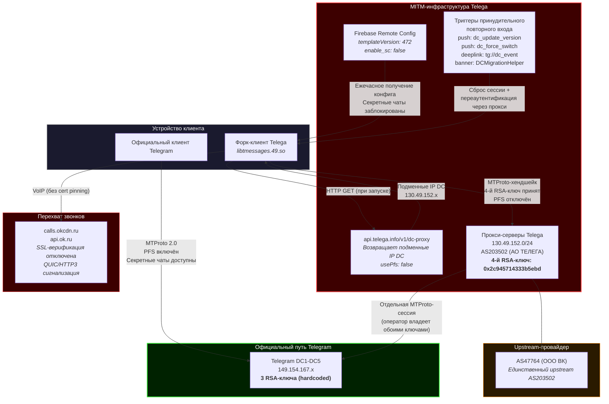
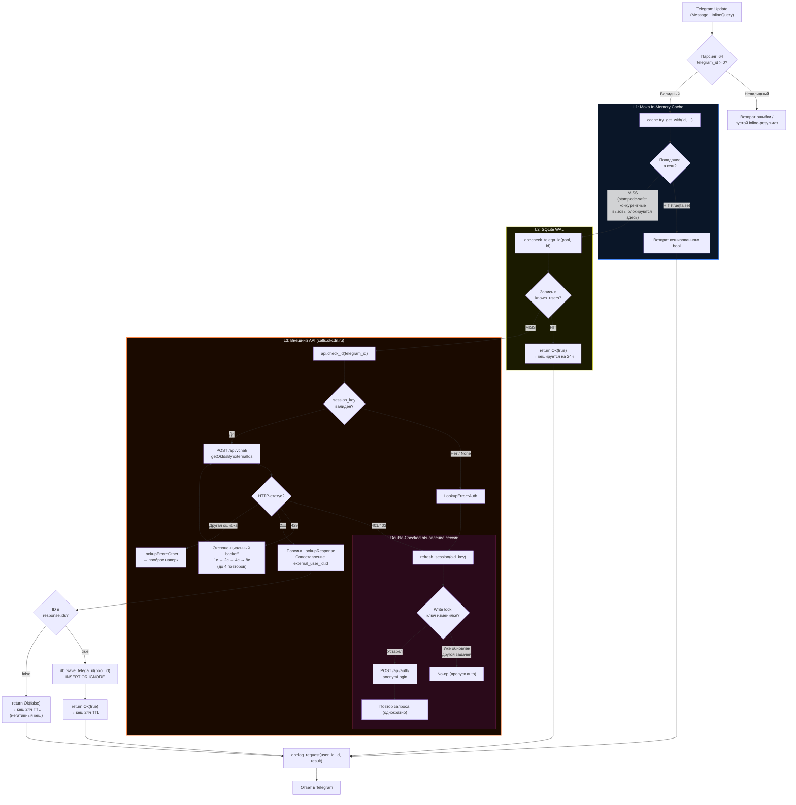

# telega-checker-rs

*Прочитать на других языках: [English](../README.md), [Русский](README_RU.md).*

Высокопроизводительный Telegram-бот и HTTP API для обнаружения аккаунтов, скомпрометированных MITM-форком **Telega**. Написан на Rust. Реализует архитектуру **Dual-Core BFF (Backend-For-Frontend)**: Telegram-бот (teloxide long-polling) и HTTP API-сервер (axum) работают параллельно на одном tokio-рантайме, совместно используя один и тот же `AppState` (moka-кеш, SQLite-пул, API-клиент). Работает в трёх режимах: **реактивный** (личные сообщения / inline-запросы), **пассивный** (мониторинг групп с ежедневным сканированием) и **HTTP API** (RESTful-эндпоинт для внешних клиентов, таких как Android-плагин). Возвращает бинарный результат: присутствует или отсутствует в VoIP-инфраструктуре Telega.

Это production-версия на Rust, портированная с [notelega](https://github.com/hlnmplus/notelega) (Python/aiogram PoC). Python-реализация валидирует концепцию детектирования; данная реализация спроектирована для устойчивой конкурентной нагрузки, субмикросекундного чтения из кеша, встроенной защиты от cache stampede и потребления памяти на два порядка меньше, чем у CPython-эквивалента.

## Содержание

- [Контекст угрозы](#контекст-угрозы)
- [Индикаторы компрометации](#индикаторы-компрометации)
- [Механизм детектирования](#механизм-детектирования)
- [Архитектура](#архитектура)
- [Диаграмма архитектуры угрозы](#диаграмма-архитектуры-угрозы)
- [Диаграмма процесса детектирования](#диаграмма-процесса-детектирования)
- [Сравнительная матрица: официальный Telegram vs. Telega](#сравнительная-матрица-официальный-telegram-vs-telega)
- [Метрики производительности: Python PoC vs. Rust](#метрики-производительности-python-poc-vs-rust)
- [Структура проекта](#структура-проекта)
- [Требования](#требования)
- [Конфигурация](#конфигурация)
- [Развёртывание](#развёртывание)
- [Использование](#использование)
- [HTTP API](#http-api)
- [Пассивный мониторинг групп](#пассивный-мониторинг-групп)
- [Схема базы данных](#схема-базы-данных)
- [Заметки по операционной безопасности](#заметки-по-операционной-безопасности)
- [Лицензия](#лицензия)

---

## Контекст угрозы

**Telega** (ранее "Dal") -- Android-форк Telegram, позиционируемый как альтернатива, обходящая ограничения Роскомнадзора на голосовые/видеозвонки и доставку медиа. За этой функциональностью скрывается полноценная MITM-прокси-инфраструктура. Независимый реверс-инжиниринг (декомпиляция APK через jadx/IDA Pro, сетевой анализ и экспериментальная верификация MTProto-хендшейков) подтвердил следующую цепочку атаки:

1. **Подмена адресов DC.** При запуске Telega получает подменные IP-адреса дата-центров с `api.telega.info/v1/dc-proxy`. Все возвращаемые адреса находятся в диапазоне `130.49.152.0/24` (AS203502, АО "ТЕЛЕГА"). Метод `native_setDcVersion()` передаёт их в C++-движок Telegram, в результате чего клиент подключается к серверам Telega вместо DC1-DC5 Telegram.

2. **Инъекция RSA-ключа.** Нативная библиотека `libtmessages.49.so` содержит четыре публичных RSA-ключа. Официальный клиент Telegram содержит три. Четвёртый ключ (отпечаток `0x2c945714333b5ebd`) отклоняется серверами Telegram (`transport error -404`), но принимается прокси-серверами Telega (`server_DH_params_ok`). Владение соответствующим закрытым ключом обеспечивает классическую MITM-атаку: одна зашифрованная сессия с клиентом, отдельная сессия с реальным сервером Telegram.

3. **Отключение PFS.** Конфигурация, возвращаемая `/v1/dc-proxy`, устанавливает `usePfs: false`, отключая Perfect Forward Secrecy. Без PFS оператор, записывающий зашифрованный трафик, может дешифровать его ретроактивно при получении ключа авторизации.

4. **Блокировка секретных чатов.** Firebase Remote Config (`templateVersion: 472`) устанавливает `enable_sc: false`. Кнопка в UI скрыта, входящие запросы секретных чатов молча отклоняются `SecretChatHelper.acceptSecretChat()`, deep-ссылки не обрабатываются. Ни одна из сторон не получает уведомления.

5. **Принудительная переаутентификация.** Четыре удалённых триггера принуждают к сбросу сессии и повторному входу через прокси: push-уведомления (`dc_update_version`, `dc_force_switch`), deep-ссылка (`tg://dc_event?force_relogin=true`) и промо-баннер через `DCMigrationHelper`.

6. **Маршрутизация звонков через OK.ru.** Звонки маршрутизируются через `calls.okcdn.ru` / `api.ok.ru` (инфраструктура VK/Одноклассники) вместо серверов Telegram. VoIP-модуль (`QuicClientConnectionImpl.java:1009`) полностью отключает проверку SSL-сертификатов для QUIC/HTTP3 сигнализации звонков.

Единственный upstream-провайдер AS203502 -- **AS47764 (ООО "ВК")**. Анализ панели модерации Telega (`demo.stage.telega.info`) выявил запросы Роскомнадзора на ограничение каналов (`stream@rkn.gov.ru`) и сервис AI-модерации сообщений в реальном времени (Cerberus).

---

## Индикаторы компрометации

| Индикатор | Значение |
|---|---|
| **AS прокси** | AS203502 (АО "ТЕЛЕГА") |
| **Upstream AS** | AS47764 (ООО "ВК") |
| **Диапазон IP DC** | `130.49.152.0/24` |
| **Отпечаток подменного RSA-ключа** | `0x2c945714333b5ebd` |
| **Статус PFS** | Отключён (`usePfs: false`) |
| **Флаг секретных чатов** | `enable_sc: false` (Firebase Remote Config) |
| **Эндпоинт конфигурации DC** | `api.telega.info/v1/dc-proxy` |
| **Сигнализация звонков** | `calls.okcdn.ru`, `api.ok.ru` |
| **Нативная библиотека** | `libtmessages.49.so` (4 RSA-ключа по смещению `0x15788E1`) |

---

## Механизм детектирования

Форк Telega маршрутизирует голосовые и видеозвонки через VoIP-бэкенд VK/Одноклассники на `calls.okcdn.ru`. Этот бэкенд предоставляет недокументированный API-эндпоинт, который связывает внешние (Telegram) user ID с внутренними идентификаторами OK.ru. Если для заданного Telegram ID существует такая связь, данный аккаунт взаимодействовал с инфраструктурой звонков Telega и, следовательно, скомпрометирован.

### Протокол API

**Аутентификация:**

```
POST https://calls.okcdn.ru/api/auth/anonymLogin
Content-Type: application/x-www-form-urlencoded

application_key=<APPLICATION_KEY>&session_data={"device_id":"telega_checker_bot","version":2,"client_version":"android_8","client_type":"SDK_ANDROID"}
```

Возвращает: `{"session_key": "<token>"}`

**Запрос проверки:**

```
POST https://calls.okcdn.ru/api/vchat/getOkIdsByExternalIds
Content-Type: application/x-www-form-urlencoded

application_key=<APPLICATION_KEY>&session_key=<SESSION_KEY>&externalIds=[{"id":"<TELEGRAM_ID>","ok_anonym":false}]
```

При совпадении: `{"ids": [{"ok_user_id": <int>, "external_user_id": {"id": "<TELEGRAM_ID>", "ok_anonym": false}}]}`
При отсутствии: `{"error_code": 4, ...}` или `{"ids": []}`

Сессионный ключ периодически истекает. Реализация обрабатывает это прозрачно через повторный запрос при 401/403 с double-checked locking для предотвращения избыточной переаутентификации при конкурентном доступе. Rate-лимиты API (HTTP 429) обрабатываются через экспоненциальный backoff (до 4 повторов: 1с → 2с → 4с → 8с).

---

## Архитектура

Приложение реализует дизайн **Dual-Core**: Telegram-бот (teloxide) и HTTP API-сервер (axum) работают параллельно на одном tokio-рантайме через `tokio::select!`, совместно используя единый `AppState`. Это гарантирует, что попадание в кеш со стороны бота мгновенно приносит пользу API, и наоборот. Оба ядра используют трёхуровневый поиск с различными характеристиками задержки и персистентности на каждом уровне. Бот дополнительно работает как пассивный монитор групп с ежедневным плановым сканированием. Выделенная ветка `tokio::signal::ctrl_c()` обеспечивает graceful shutdown всех подсистем — HTTP-сервера, Telegram-диспетчера и планировщика ежедневного сканирования — при SIGTERM или Ctrl+C.

### Сетевая топология

```
Android-плагин ──HTTPS──▶ Cloudflare (SSL-терминация)
                                    │
                              HTTPS (Origin Cert)
                                    │
                                    ▼
                              Nginx :443 (rate limiting)
                                    │
                               HTTP (внутренний)
                                    │
                                    ▼
Telegram ──Long Polling──▶ Rust-контейнер :8080
                              ┌─────────────────┐
                              │   tokio runtime │
                              │  ┌─────┐ ┌─────┐│
                              │  │Axum │ │Telox││
                              │  │ API │ │ ide ││
                              │  └──┬──┘ └──┬──┘│
                              │     └───┬───┘   │
                              │    AppState     │
                              │  (общий, zero-  │
                              │   cost clones)  │
                              └─────────────────┘
```

Rust-контейнер находится за **Nginx reverse proxy** внутри Docker. Nginx обрабатывает SSL-терминацию (через Cloudflare Origin Certificate) и rate limiting (20 запросов/с на IP для `/api/`). Контейнер **не** выставляет порты на хост — только во внутреннюю Docker-сеть.

### Конвейер пассивного мониторинга

При добавлении в группу бот бесшумно отслеживает участников через три источника событий:

1. **Наблюдение за сообщениями** — каждое сообщение в группе записывает `(chat_id, user_id)` в таблицу `chat_members`. Moka-кеш дедупликации (TTL 5 мин, ёмкость 50K) предотвращает I/O базы данных при каждом сообщении.
2. **События вступления** — обновления `NewChatMembers` отслеживаются немедленно (минуя дедупликацию).
3. **События выхода** — `LeftChatMember` выполняет мягкое удаление (`is_active = FALSE`).

### Ежедневное сканирование

Задача `tokio-cron-scheduler` запускается ежедневно в **09:00 UTC**. Хэндл планировщика хранится в `main.rs` и корректно завершается при выходе из приложения (без утечек ресурсов):

1. Получает все уникальные `chat_id` с активными участниками из `chat_members`.
2. Для каждого чата проверяет все активные `user_id` через трёхуровневый поиск.
3. Ограничивает конкурентные API-проверки до 10 через `futures::stream::buffer_unordered`.
4. Rate-лимиты API (HTTP 429) поглощаются прозрачно через экспоненциальный backoff — отдельные запросы повторяются до 4 раз (1с → 2с → 4с → 8с) без блокировки tokio-рантайма.
5. Отправляет агрегированный HTML-отчёт в чаты с положительными результатами. Тишина, если находок нет.
6. **Самоочистка**: если отправка не удаётся с ошибками `BotKicked` / `ChatNotFound` и подобными, все участники этого чата мягко удаляются для экономии ресурсов при будущих сканированиях.

### Трёхуровневый поиск

```
Telegram Update (Message | InlineQuery)
        |
        v
   Валидация ввода (parse i64, отклонение неположительных)
        |
        v
+-------+---------------------------+
| L1: Moka In-Memory Cache          |
| - Cache<i64, bool>                |
| - Ёмкость 100 000 записей (LRU)  |
| - TTL 24 часа (positive+negative) |
| - try_get_with: stampede-safe      |
+-------+---------------------------+
        | MISS
        v
+-------+---------------------------+
| L2: SQLite (WAL mode)             |
| - Таблица known_users             |
| - Поиск по INTEGER PRIMARY KEY    |
| - Только положительные результаты |
+-------+---------------------------+
        | MISS
        v
+-------+---------------------------+
| L3: API calls.okcdn.ru            |
| - POST getOkIdsByExternalIds      |
| - Управление сессией через RwLock |
| - Double-checked refresh при 401  |
| - Положит. результаты → L2        |
+-------+---------------------------+
        |
        v
   Ответ в Telegram
```

### Защита от cache stampede

`moka::future::Cache::try_get_with` -- ключевой примитив конкурентности. Когда N одновременных запросов приходят для одного некешированного `telegram_id`, ровно один вызывающий входит в асинхронное замыкание (путь L2 + L3). Остальные N-1 вызывающих блокируются на внутреннем waiter и получают результат по завершении работы первого вызывающего. Это исключает избыточные запросы к базе данных и API при пиковой нагрузке.

### Управление сессией

`ApiClient` хранит сессионный ключ за `tokio::sync::RwLock<Option<String>>`. Множество обработчиков читают конкурентно (`RwLock::read`); при 401/403 `refresh_session` захватывает write-блокировку и выполняет double-checked locking: если другая задача уже обновила ключ, пока текущая ждала блокировку, обновление пропускается. Это предотвращает ситуацию, когда N конкурентных ошибок вызывают N запросов аутентификации.

### Обработка rate-лимитов API

Ответы HTTP 429 от `calls.okcdn.ru` обрабатываются через **экспоненциальный backoff**. Когда API возвращает 429 (Too Many Requests), клиент повторяет запрос до 4 раз с возрастающими задержками: 1с → 2с → 4с → 8с. Backoff использует `tokio::time::sleep` (неблокирующий — не останавливает tokio-рантайм). Если все повторы исчерпаны, ошибка передаётся вызывающему. Это критически важно для ежедневного сканирования, где сотни конкурентных запросов могут вызвать rate limiting.

---

## Диаграмма архитектуры угрозы

Следующая диаграмма иллюстрирует расхождение между легитимной MTProto-сессией Telegram и сессией, маршрутизированной через MITM-инфраструктуру Telega (AS203502 / AS47764).



**Возможности оператора при активации MITM:** чтение всех облачных чатов; просмотр полной истории сообщений и метаданных (IP, устройство, ОС); модификация трафика в реальном времени; выполнение любых действий от имени пользователя (подписка, отправка, удаление); хранение и передача расшифрованных данных третьим сторонам, включая государственные структуры. Секретные чаты молча подавляются; собеседник не получает уведомления об отклонении.

---

## Диаграмма процесса детектирования

Бот реализует трёхуровневый поиск с защитой от cache stampede через `moka::future::Cache::try_get_with`. Конкурентные запросы для одного Telegram ID объединяются на уровне L1; только первый вызывающий выполняет замыкание.



---

## Сравнительная матрица: официальный Telegram vs. Telega

| Параметр | Официальный Telegram | Форк Telega |
|---|---|---|
| **Диапазоны IP DC** | `149.154.167.x` (собственность Telegram) | `130.49.152.0/24` (AS203502, АО ТЕЛЕГА) |
| **Upstream AS** | Собственная инфраструктура Telegram | AS47764 (ООО ВК) -- единственный upstream-провайдер |
| **RSA-ключи (MTProto-хендшейк)** | 3 захардкоженных публичных ключа | 4 ключа; 4-й (`0x2c945714333b5ebd`) отклоняется Telegram DC, принимается прокси Telega |
| **Perfect Forward Secrecy** | Включён по умолчанию | Отключён (`usePfs: false` через конфиг `/v1/dc-proxy`) |
| **Секретные чаты** | Доступны; E2E через DH-2048 | Заблокированы: UI скрыт, входящие запросы молча отклоняются (`enable_sc: false`, Firebase Remote Config) |
| **Маршрутизация звонков** | Серверы Telegram (STUN/TURN) | `calls.okcdn.ru` / `api.ok.ru` (инфраструктура VK/Одноклассники) |
| **SSL-верификация звонков** | Стандартная проверка TLS-сертификатов | Отключена (`QuicClientConnectionImpl.java:1009`) |
| **DNS-разрешение** | Разрешено | Заблокировано клиентом |
| **Контроль хендшейка** | Сервер Telegram | Прокси-сервер Telega |
| **Принудительный повторный вход** | Не применимо | 4 удалённых триггера (push, deep link, промо-баннер) |
| **Незашифрованный HTTP** | Не разрешён | `android:usesCleartextTraffic="true"` в манифесте |
| **SSL Pinning** | Применяется для основных доменов | Отсутствует для `api.telega.info`, `calls.okcdn.ru`, `api.ok.ru` |
| **Телеметрия** | Стандартная аналитика Telegram | MyTracker (VK); передаёт статус VPN |
| **Запрашиваемые разрешения** | Минимальные для мессенджера | 75 разрешений (включая установку APK, фоновую геолокацию) |
| **Независимый аудит** | Протокол формально верифицирован (символьная модель, ScienceDirect 2023) | Аудит отсутствует; инфраструктура не верифицируема независимо |

---

## Метрики производительности: Python PoC vs. Rust

Теоретические проекции при устойчивой нагрузке. Python PoC предполагает `aiogram` 3.x на CPython 3.12 с `aiosqlite`. Rust-реализация использует стек из `Cargo.toml`: `teloxide` 0.17, `moka` 0.12, `sqlx` 0.8 (SQLite), `reqwest` 0.13 на `tokio` 1.x.

| Метрика | Python (`aiogram` + `aiosqlite`) | Rust (`teloxide` + `moka` + `sqlx`) |
|---|---|---|
| **L1 Cache Lookup (hot path)** | ~50-200 мкс (Python dict / `cachetools` TTLCache; ограничен GIL) | ~0.1-1 мкс (`moka` lock-free concurrent hash map) |
| **L2 SQLite Read** | ~200-800 мкс (`aiosqlite`; overhead thread-pool bridge) | ~10-50 мкс (`sqlx` + WAL mode; нативный async I/O, без GIL) |
| **L3 API Round-trip** | ~80-300 мс (сетевая задержка; идентично для обоих) | ~80-300 мс (сетевая задержка; идентично для обоих) |
| **Защита от cache stampede** | Требует ручной реализации (напр., `asyncio.Lock` на ключ) | Встроена через `moka::try_get_with` (per-key coalescing, zero-cost waiters) |
| **Конкурентная пропускная способность (L1 hits)** | ~2 000-5 000 req/s (GIL contention при доступе к кешу) | ~200 000-500 000 req/s (lock-free reads, без GIL) |
| **Конкурентная пропускная способность (L2 fallback)** | ~500-1 500 req/s (сериализация thread-pool) | ~20 000-50 000 req/s (async connection pool, 5 соединений) |
| **Память на 100K кешированных записей** | ~30-60 МБ (Python object overhead: 56+ байт/int, dict bucket) | ~3-6 МБ (i64 key + bool value + moka internal metadata) |
| **Размер бинарника / рантайма** | ~50 МБ (интерпретатор CPython + зависимости) | ~8-15 МБ (статически слинкованный release binary) |
| **Холодный старт (Docker)** | ~1-3 с (инициализация интерпретатора + импорт модулей) | ~10-50 мс (нативный бинарник, без инициализации рантайма) |
| **Макс. потребление памяти (idle)** | ~40-80 МБ | ~5-15 МБ |
| **Обновление сессии при контеншене** | Риск race condition без явной блокировки | Double-checked locking через `RwLock` (см. `refresh_session`) |

Задержка L3 определяется сетью и эквивалентна для обеих реализаций. Разница в производительности проявляется исключительно в пропускной способности hot-path L1/L2 и эффективности использования памяти при конкурентной нагрузке.

---

## Структура проекта

```
telega-checker-rs/
├── Cargo.toml              # Зависимости и метаданные пакета
├── Cargo.lock              # Воспроизводимое разрешение зависимостей
├── LICENSE                 # Лицензия Apache 2.0
├── Dockerfile              # Многоступенчатая сборка (rust:1.92-slim → debian:bookworm-slim)
├── docker-compose.yml      # Docker-топология: bot + nginx (Cloudflare Origin SSL)
├── .env.example            # Шаблон переменных окружения
├── nginx/
│   ├── conf.d/
│   │   └── default.conf    # Nginx reverse proxy: rate limiting, SSL, proxy_pass на bot:8080
│   └── ssl/
│       ├── origin.pem      # Cloudflare Origin Certificate (не в git)
│       └── origin-key.pem  # Закрытый ключ (не в git)
├── docs/
│   └── DEPLOY.md           # Расширенная инструкция по развёртыванию
└── src/
    ├── main.rs             # Dual-Core точка входа: tokio::select!(Axum, Teloxide, Ctrl+C) с graceful shutdown
    ├── config.rs           # AppConfig: загрузка env-переменных (токен бота, API-токен, порт, размер пула БД и т.д.)
    ├── api_server.rs       # Axum HTTP API: Bearer-аутентификация, GET /api/check/:telegram_id
    ├── api_client.rs       # ApiClient: аутентификация + поиск через calls.okcdn.ru с обновлением сессии + экспоненциальный backoff 429
    ├── bot_handler.rs      # Telegram-обработчики: /start, сообщения, inline, отслеживание групп; трёхуровневый поиск
    ├── scheduler.rs        # Ежедневное cron-сканирование: возвращает хэндл для graceful shutdown; итерация по чатам, проверка участников
    └── db.rs               # Инициализация схемы SQLite, CRUD known_users + chat_members, аналитическое логирование
```

---

## Требования

- [Docker](https://docs.docker.com/get-docker/) и [Docker Compose](https://docs.docker.com/compose/install/)
- Токен Telegram-бота от [@BotFather](https://t.me/BotFather)
- Включённый inline-режим для бота (через BotFather: `/setinline`)

Для локальной разработки без Docker:
- Rust 1.92+ (edition 2024)
- `pkg-config` и `libssl-dev` (Debian/Ubuntu) или аналог для `native-tls`

---

## Конфигурация

Скопируйте шаблон и заполните обязательные значения:

```bash
cp .env.example .env
```

| Переменная | Обязательна | По умолчанию | Описание |
|---|---|---|---|
| `TELOXIDE_TOKEN` | Да | -- | Токен Telegram-бота от @BotFather |
| `DATABASE_URL` | Да | `sqlite:telega_checker.db?mode=rwc` | Строка подключения SQLite. В Docker переопределяется на `/app/data/telega_checker.db` через `docker-compose.yml`. |
| `APPLICATION_KEY` | Нет | `CHKIPMKGDIHBABABA` | Ключ приложения OK.ru API для аутентификации на `calls.okcdn.ru` |
| `API_BEARER_TOKEN` | Да | -- | Bearer-токен для аутентификации HTTP API-запросов (используется Android-плагином) |
| `API_PORT` | Нет | `8080` | Порт для Axum HTTP API-сервера |
| `DATABASE_MAX_CONNECTIONS` | Нет | `5` | Максимальный размер пула соединений SQLite. Увеличьте для развёртываний с большим количеством конкурентных сканирований групп. |
| `RUST_LOG` | Нет | `info` | Директива фильтра трейсинга. `debug` для подробного вывода, `warn` для production. |

---

## Развёртывание

### Docker (рекомендуется)

Production-топология состоит из двух Docker-сервисов за Cloudflare Proxy:

| Сервис | Образ | Порты (хост) | Роль |
|---|---|---|---|
| `bot` | build: `.` | Нет (внутренний) | Dual-Core Rust-приложение (Telegram-бот + HTTP API на :8080) |
| `nginx` | `nginx:alpine` | `80`, `443` | Reverse proxy, SSL (Cloudflare Origin Cert), rate limiting |

#### Перед развёртыванием

1. **Cloudflare Origin Certificate**: разместите `origin.pem` и `origin-key.pem` в `nginx/ssl/`. Сгенерируйте в Cloudflare Dashboard → SSL/TLS → Origin Server.
2. **Режим SSL Cloudflare**: установите **Full (strict)** в Dashboard → SSL/TLS → Overview.
3. **DNS**: направьте домен на IP сервера с включённым Cloudflare Proxy (оранжевое облако).

```bash
# Сборка и запуск в фоновом режиме
docker compose up -d --build
```

Первая сборка компилирует полное дерево зависимостей Rust (~3-5 минут). Последующие сборки используют кеширование Docker-слоёв и завершаются за секунды, если `Cargo.toml` или `Cargo.lock` не изменились.

```bash
# Просмотр логов в реальном времени
docker compose logs -f

# Остановка (сохраняет том SQLite)
docker compose down

# Остановка и удаление всех данных
docker compose down -v
```

Именованный том `bot_data` монтируется в `/app/data` внутри контейнера. База данных SQLite сохраняется между циклами `down` + `up`.

| Том | Путь в контейнере | Содержимое |
|---|---|---|
| `bot_data` | `/app/data` | `telega_checker.db`, `*.db-wal`, `*.db-shm` |

### Локальная разработка

```bash
# Убедитесь, что .env заполнен (включая API_BEARER_TOKEN)
cargo run --release
```

Бинарник читает `.env` из рабочей директории через `dotenvy`. Telegram-бот и HTTP API-сервер запускаются параллельно. База данных SQLite создаётся по пути, указанному в `DATABASE_URL`.

### Детали Dockerfile

Dockerfile реализует двухступенчатую сборку:

1. **Стадия сборки** (`rust:1.92-slim-bookworm`): компиляция release-бинарника с кешированием зависимостей (трюк с dummy `main.rs` для раздельного кеширования скомпилированных зависимостей и кода приложения).
2. **Стадия рантайма** (`debian:bookworm-slim`): минимальный образ только с `ca-certificates` и `libssl3`. Запускается от непривилегированного пользователя `appuser` (UID 1001). Выставляет порт `8080` для внутренней Docker-сети.

---

## Использование

### Личное сообщение

Отправьте числовой Telegram ID боту:

```
123456789
```

Ответ:
- Присутствует в инфраструктуре Telega: `ДА -- этот ID зарегистрирован в Telega.`
- Не найден: `НЕТ -- этот ID не найден в Telega.`

### Inline-запрос

В любом чате Telegram введите:

```
@telega_checker_rs_bot 123456789
```

Результаты кешируются на стороне Telegram на 300 секунд (5 минут) через `cache_time`.

### Упоминание в группе

Когда бот добавлен в группу или супергруппу, вы можете проверить ID, упомянув бота:

```
@telega_checker_rs_bot 123456789
```

Бот ответит прямо в группе результатом проверки. Невалидные или пустые ID молча игнорируются для предотвращения спама.

### Команда /start

Отображает инструкции по использованию и ссылку на OSINT-статью о механизмах перехвата Telega.

---

## HTTP API

Axum HTTP API-сервер предоставляет RESTful-эндпоинт для внешних клиентов (напр., Android-плагин). Работает на том же tokio-рантайме, что и Telegram-бот, и использует идентичный `AppState` — попадания в кеш со стороны бота приносят пользу API, и наоборот.

### Аутентификация

Все API-запросы требуют Bearer-токен в заголовке `Authorization`:

```
Authorization: Bearer <API_BEARER_TOKEN>
```

Запросы без валидного токена получают ответ `401 Unauthorized`.

### Эндпоинт

#### `GET /api/check/:telegram_id`

Проверяет, зарегистрирован ли Telegram user ID в инфраструктуре Telega.

**Успех (200):**
```json
{"telegram_id": 123456789, "is_compromised": true}
```

**Невалидный ID (400):**
```json
{"error": "Invalid telegram_id 'abc'. Must be a positive integer."}
```

**Ошибка аутентификации (401):**
```json
{"error": "Invalid bearer token"}
```

**Ошибка сервера (500):**
```json
{"error": "Internal lookup error. Please try again later."}
```

### Пример

```bash
curl -H "Authorization: Bearer YOUR_TOKEN" https://checker.berektassuly.com/api/check/123456789
```

### Rate Limiting

Nginx ограничивает запросы до **20 запросов/секунду на IP** с burst=10 на всех `/api/`-эндпоинтах. Избыточные запросы получают ответ `429 Too Many Requests`.

---

## Пассивный мониторинг групп

При добавлении в группу или супергруппу бот работает бесшумно как пассивный монитор.

### Принцип работы

1. **Автоматическое отслеживание**: бот наблюдает за всеми сообщениями и событиями входа/выхода. Команды не нужны — просто добавьте бота в группу.
2. **Ежедневное сканирование в 09:00 UTC**: бот проверяет каждого отслеживаемого участника через трёхуровневый поиск (moka → SQLite → okcdn.ru API).
3. **Отчёт при обнаружении**: если обнаружены скомпрометированные аккаунты, бот отправляет единый отчёт:

```
Daily Scan Report

The following members are using the compromised Telega client:

1. User
2. User
```

4. **Тишина при чистых результатах**: если пользователей Telega не найдено, сообщение не отправляется.
5. **Самоочистка**: если бот удалён из группы, он автоматически деактивирует все записи отслеживания для этой группы.

### Требования к группе

- Бот должен иметь разрешение на чтение сообщений в группе.
- Права администратора не требуются — бот только читает и отправляет сообщения.
- Бот отслеживает пользователей пассивно; он не банит, не мьютит и не ограничивает никого.

### Хранение данных

Отслеживание использует модель мягкого удаления. Когда пользователь покидает группу или бот удалён, записи помечаются `is_active = FALSE` вместо удаления. Это сохраняет историческую аналитику, исключая неактивных участников из будущих сканирований.

---

## Схема базы данных

SQLite с включённым WAL-режимом (`PRAGMA journal_mode=WAL`) для конкурентной производительности чтения.

### `known_users` (функционально необходима)

Персистентный L2-кеш Telegram ID, подтверждённых как присутствующие в инфраструктуре Telega.

```sql
CREATE TABLE IF NOT EXISTS known_users (
    telegram_id  INTEGER PRIMARY KEY,
    discovered_at TEXT NOT NULL DEFAULT (datetime('now'))
);
```

### `bot_users` (аналитика)

Отслеживает пользователей, взаимодействовавших с ботом. Используется для статистики и rate-limiting.

```sql
CREATE TABLE IF NOT EXISTS bot_users (
    user_id    INTEGER PRIMARY KEY,
    username   TEXT,
    first_seen TEXT NOT NULL DEFAULT (datetime('now')),
    last_seen  TEXT NOT NULL DEFAULT (datetime('now'))
);
```

### `requests_log` (аналитика)

Append-only журнал всех событий поиска. Обеспечивает операционный мониторинг и анализ паттернов запросов.

```sql
CREATE TABLE IF NOT EXISTS requests_log (
    id         INTEGER PRIMARY KEY AUTOINCREMENT,
    user_id    INTEGER NOT NULL,
    queried_id INTEGER NOT NULL,
    result     TEXT    NOT NULL,
    created_at TEXT    NOT NULL DEFAULT (datetime('now'))
);
```

### `chat_members` (пассивный мониторинг)

Отслеживает присутствие пользователей в группах. Использует паттерн мягкого удаления (`is_active`) для сохранения истории.

```sql
CREATE TABLE IF NOT EXISTS chat_members (
    chat_id   INTEGER NOT NULL,
    user_id   INTEGER NOT NULL,
    is_active BOOLEAN NOT NULL DEFAULT TRUE,
    PRIMARY KEY (chat_id, user_id)
);
```

---

## Заметки по операционной безопасности

Таблицы `bot_users` и `requests_log` предоставлены для операционной аналитики (статистика использования, отладка, принятие решений по rate-limiting). Они не требуются для основного функционала детектирования. Единственная таблица, необходимая для корректной работы трёхуровневого поиска -- `known_users`.

Операторы, развёртывающие бот в средах с приоритетом минимизации метаданных, могут отключить аналитическое логирование, удалив или закомментировав вызовы `db::log_request()` и `db::log_bot_user()` в `src/bot_handler.rs`. Это простая модификация, ограниченная двумя точками вызова в `handle_message` и одной в `handle_inline_query`.

Альтернативный подход для операторов, которым нужна аналитика при разработке, но не в production: введение feature-флага Cargo (напр., `analytics`), условно компилирующего код логирования. Пример добавления в `Cargo.toml`:

```toml
[features]
default = []
analytics = []
```

Затем оберните вызовы логирования в `#[cfg(feature = "analytics")]` и компилируйте с `cargo build --release --features analytics` только при необходимости.

Для эфемерных развёртываний, где данные не должны сохраняться между перезапусками, смонтируйте том SQLite как `tmpfs`:

```yaml
volumes:
  - type: tmpfs
    target: /app/data
```

Учтите, что это также делает L2-кеш (`known_users`) эфемерным, вынуждая все запросы обращаться к L3 до повторного заполнения кеша.

---

## Лицензия

Этот проект лицензирован под [Apache License 2.0](../LICENSE).
