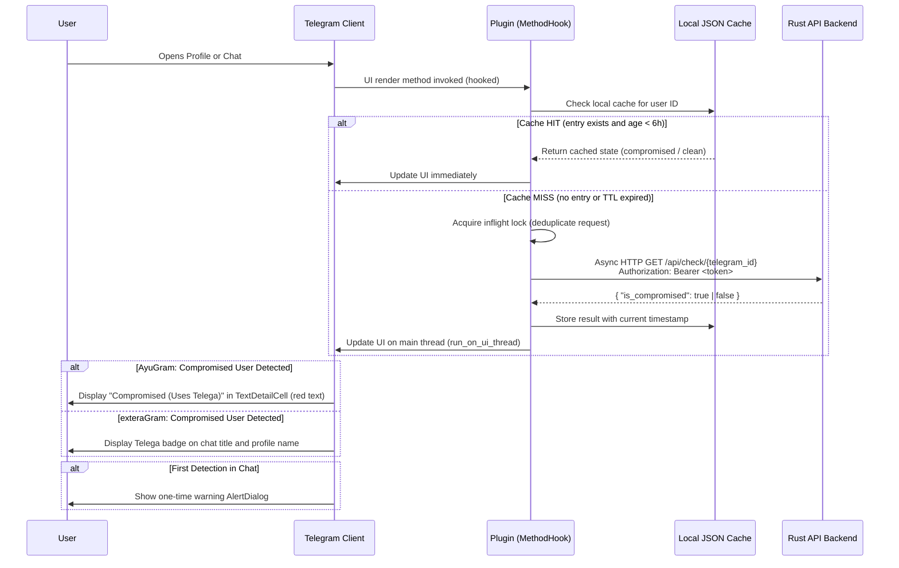

# Telega Checker — Client Plugins

*Read this in other languages: [English](README.md), [Русский](README_RU.md).*

Android detection plugins for [AyuGram](https://github.com/AyuGram) and [exteraGram](https://github.com/AyuGram/AyuGram4A) Telegram clients. Each plugin interfaces with the [telega-checker-rs](https://github.com/Berektassuly/telega-checker-rs) Rust backend to identify users of the Telega man-in-the-middle fork client in real time.

**Author:** [@Berektassuly](https://github.com/Berektassuly)
**Version:** 1.1.0
**License:** [Apache License 2.0](../LICENSE)

---

## Table of Contents

- [Overview](#overview)
- [Architecture](#architecture)
- [Detection Flow](#detection-flow)
- [Client-Specific Features](#client-specific-features)
- [Installation](#installation)
- [Configuration](#configuration)
- [Security and Privacy](#security-and-privacy)
- [Technical Implementation Details](#technical-implementation-details)
- [Download](#download)

---

## Overview

The Telega Checker plugins extend AyuGram and exteraGram with a passive detection capability that determines whether a contact is using the Telega fork client. Telega routes user traffic through a man-in-the-middle proxy infrastructure (AS203502, JSC TELEGA), enabling full session interception. The plugins query the `telega-checker-rs` Rust API backend over HTTPS, cache results locally, and inject visual indicators into the client's native UI without modifying the application itself. No administrative privileges or special permissions are required.

The detection is non-intrusive: the plugin reads a user's Telegram ID from the client's internal data model, dispatches an asynchronous HTTP request to the backend, and renders the result. At no point does the plugin access message content, contact lists, or any data beyond the numeric user ID of the profile being viewed.

---

## Architecture

The plugin system operates as a three-component pipeline.

```
+---------------------------+          +--------------------------+          +----------------------------+
|   Telegram Client (UI)    |          |     Plugin Runtime       |          |   telega-checker-rs (API)  |
|                           |          |                          |          |                            |
|  ProfileActivity          | hook --> |  MethodHook subclasses   | HTTPS -> |  GET /api/check/:id        |
|  ChatActivity             | hook --> |  TelegaCheckerPlugin     | <-----   |  { is_compromised: bool }  |
|  Theme / Color system     | hook --> |  Local JSON cache (6h)   |          |  Bearer Token auth         |
+---------------------------+          +--------------------------+          +----------------------------+
```

| Component | Role | Technology |
|---|---|---|
| **Telegram Client** | Host application providing the UI surface and internal APIs | Android (Java), AyuGram or exteraGram fork |
| **Plugin Runtime** | Hooks into client methods via reflection; manages cache and network calls | Python (Jython bridge), `BasePlugin` / `MethodHook` API |
| **Rust Backend** | Performs the actual Telega detection via a three-tier lookup (moka cache, SQLite, okcdn.ru API) | Rust, Axum HTTP server, Bearer token authentication |

The plugin does not perform detection directly. It delegates all lookups to the Rust backend via `GET /api/check/{telegram_id}`, authenticating with a user-configured Bearer token. The backend returns a JSON response containing a single boolean field (`is_compromised`).

---

## Detection Flow

The following diagram illustrates the end-to-end sequence from UI interaction to visual indicator rendering.



---

## Client-Specific Features

Each plugin is exclusive to its target client. They share the same backend protocol and caching logic but differ in UI injection strategy.

| Feature | AyuGram | exteraGram |
|---|---|---|
| **UI Indicator Type** | `TextDetailCell` row in ProfileActivity | Badge icon on chat title and profile name |
| **Indicator Location** | Profile info section (below phone/username/bio) | Inline with user name (both ChatActivity and ProfileActivity) |
| **Color Coding** | Red (compromised), Green (clean), Default (checking) | Badge presence indicates compromised status |
| **Badge Click Action** | N/A | Displays warning AlertDialog on tap |
| **Profile Integration** | Injects a custom row via `updateRowsIds` / `onBindViewHolder` hooks | Injects badge via `updateProfileData` / `getBadgeDrawable` hooks |
| **Chat Integration** | Alert on `onResume` if user is compromised | Badge on `onResume` and `updateTitle`; alert on first detection |
| **Row Shifting** | Shifts all subsequent `*Row` fields via reflection to accommodate injected row | N/A (badge overlays existing UI) |
| **Badge Sticker Resolution** | N/A | Resolves sticker document ID from `telega_me` pack (index 8) via `MediaDataController` |
| **First-Open Warning Alert** | Yes | Yes |
| **Local Result Cache (6h TTL)** | Yes | Yes |
| **HTTPS-Only Enforcement** | Yes | Yes |
| **Bearer Token Validation** | Yes | Yes |
| **Minimum Client Version** | 11.12.0 | 11.12.0 |

---

## Installation

### Prerequisites

- AyuGram or exteraGram installed on an Android device (minimum client version 11.12.0)
- A running instance of `telega-checker-rs` with a configured `API_BEARER_TOKEN`
- Network access from the device to the API endpoint over HTTPS

### Steps

1. Download the `.plugin` file corresponding to your client from the [Download](#download) section.
2. Open your Telegram client (AyuGram or exteraGram).
3. Navigate to **Settings** → **Plugins**.
4. Import the downloaded `.plugin` file.
5. Open **Plugin Settings** and configure the two required fields:
   - **API URL** — the base URL of your `telega-checker-rs` instance (default: `https://tc.berektassuly.com`)
   - **Bearer Token** — the value of `API_BEARER_TOKEN` from the server's `.env` configuration

The plugin activates immediately after configuration. No client restart is required.

> [!IMPORTANT]
> Each plugin is **exclusive** to its target client. The AyuGram plugin will not function on exteraGram, and vice versa. Install only the variant that matches your application.

---

## Configuration

The plugin exposes two configurable settings via the in-app Plugin Settings menu.

| Setting | Key | Default | Description |
|---|---|---|---|
| **API URL** | `api_base_url` | `https://tc.berektassuly.com` | Base URL of the `telega-checker-rs` HTTP API. Must use the `https://` scheme. |
| **Bearer Token** | `api_bearer_token` | *(empty)* | Bearer token for API authentication. Must match the `API_BEARER_TOKEN` environment variable on the server. |

### Validation Rules

The plugin enforces the following constraints before any network request is dispatched:

1. **HTTPS enforcement.** If `api_base_url` does not begin with `https://`, all API calls are blocked. An error is logged: `"API URL must use HTTPS to protect your bearer token."`
2. **Token presence.** If `api_bearer_token` is empty or matches the placeholder value `your_secret_api_token_here`, all API calls are blocked. An error is logged: `"Bearer token not configured."`

Both validations occur at call time (`_validate_config`), not at plugin load. This permits the user to configure settings after the plugin is loaded without requiring a restart.

---

## Security and Privacy

### Data Transmitted

The plugin transmits exactly one datum per lookup: the numeric Telegram user ID (a 64-bit integer). This ID is sent as a path parameter in the HTTPS GET request:

```
GET https://<api_base_url>/api/check/<telegram_id>
Authorization: Bearer <token>
```

No message content, contact lists, phone numbers, usernames, or metadata beyond the Telegram ID are transmitted.

### Transport Security

- All API communication is conducted over HTTPS (TLS). The plugin explicitly rejects HTTP URLs at the configuration validation layer.
- The Bearer token is included in the `Authorization` header and is protected by the TLS channel.
- The plugin uses a persistent `requests.Session` for connection pooling (HTTP Keep-Alive), reducing TLS handshake overhead for repeated lookups.

### Local Data Storage

- **Lookup cache.** Results are stored in the plugin's local settings as a JSON dictionary, keyed by Telegram user ID. Each entry contains a boolean result and a UNIX timestamp. Entries expire after 6 hours (21,600 seconds). The cache is pruned on plugin startup (`_evict_expired_cache`) and is capped at 2,000 entries; when the limit is exceeded, the oldest 25% of entries are evicted.
- **Alert-shown registry.** A separate JSON dictionary tracks which users have already triggered the one-time warning alert, preventing repeated notifications for the same user. This registry is also capped at 2,000 entries with identical eviction logic.
- **No external persistence.** The plugin does not write to files, databases, or external storage beyond the plugin settings mechanism provided by the client runtime.

### Concurrency Safety

- A `threading.Lock` (`_inflight_lock`) guards the in-flight lookup set, preventing duplicate concurrent requests for the same user ID.
- UI updates are dispatched to the main thread via `run_on_ui_thread`, avoiding cross-thread UI modification.

---

## Technical Implementation Details

### Method Hooking (UI Injection)

Both plugins use the `MethodHook` API provided by the client's plugin runtime to intercept internal UI methods at runtime. No bytecode modification or APK patching occurs; hooks are applied via Java reflection at plugin load time.

**AyuGram hooks:**

| Hook Class | Target Method | Purpose |
|---|---|---|
| `RowsHook` | `ProfileActivity.updateRowsIds` | Inserts a custom row index and shifts subsequent `*Row` fields |
| `TypeHook` | `ProfileActivity$ListAdapter.getItemViewType` | Returns `TextDetailCell` type (2) for the injected row |
| `BindHook` | `ProfileActivity$ListAdapter.onBindViewHolder` | Binds "Telega Status" text and color to the injected cell |
| `ColorHook` | `TextDetailCell.updateColors` | Reapplies custom colors after theme changes |
| `ChatResumeHook` | `ChatActivity.onResume` | Triggers lookup and alert on chat open |

**exteraGram hooks:**

| Hook Class | Target Method | Purpose |
|---|---|---|
| `_ChatResumeHook` | `ChatActivity.onResume` | Triggers lookup, badge application, and alert |
| `_ChatUpdateTitleHook` | `ChatActivity.updateTitle` | Reapplies badge when the title view is refreshed |
| `_ProfileUpdateHook` | `ProfileActivity.updateProfileData` | Applies badge to profile name views |

### Caching Mechanism

- **Storage format:** JSON dictionary persisted via `set_setting` / `get_setting` (plugin runtime API).
- **Key:** String representation of the Telegram user ID.
- **Value:** `{ "value": bool, "checked_at": int }` where `checked_at` is a UNIX epoch timestamp.
- **TTL:** 6 hours (21,600 seconds). Expired entries are treated as cache misses.
- **Eviction policy:** LRU-approximated. When the cache exceeds 2,000 entries, the oldest 25% by `checked_at` are removed.
- **Startup pruning:** All expired entries are evicted on plugin load to minimize persistent storage usage.

### Badge Resolution (exteraGram only)

The exteraGram plugin renders a visual badge using the `BadgeDTO` class exclusive to the exteraGram client. The badge sticker is resolved from the `telega_me` sticker pack (index 8) via `MediaDataController.getStickerSetByName`. If the sticker set is not locally cached, the plugin requests it from Telegram's servers and polls for availability at 350ms intervals (up to 10 iterations, ~3.5s ceiling). The resolved document ID is persisted across plugin reloads.

---

## Download

| Client | Version | File | Download |
|---|---|---|---|
| **AyuGram** | v1.1.0 | `telega_checker_rust_AyuGram.plugin` | [Download](https://github.com/Berektassuly/telega-checker-rs/raw/main/plugins/telega_checker_rust_AyuGram.plugin) |
| **exteraGram** | v1.1.0 | `telega_checker_rust_exteraGram.plugin` | [Download](https://github.com/Berektassuly/telega-checker-rs/raw/main/plugins/telega_checker_rust_exteraGram.plugin) |
