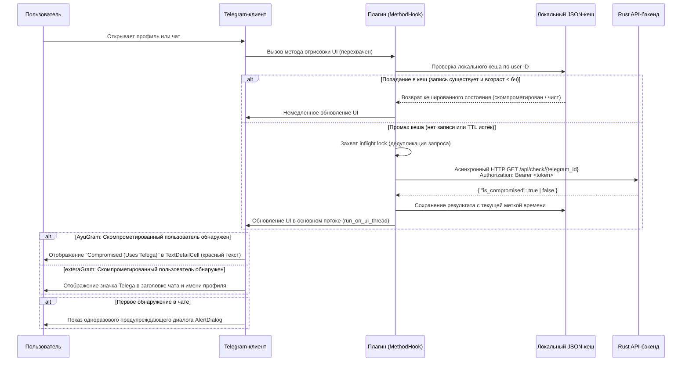

# Telega Checker — Клиентские плагины

*Прочитать на других языках: [English](README.md), [Русский](README_RU.md).*

Android-плагины для обнаружения пользователей Telega в клиентах [AyuGram](https://github.com/AyuGram) и [exteraGram](https://github.com/AyuGram/AyuGram4A). Каждый плагин взаимодействует с Rust-бэкендом [telega-checker-rs](https://github.com/Berektassuly/telega-checker-rs) для обнаружения пользователей MITM-форка Telega в реальном времени.

**Автор:** [@Berektassuly](https://github.com/Berektassuly)
**Версия:** 1.1.0
**Лицензия:** [Apache License 2.0](../LICENSE)

---

## Содержание

- [Обзор](#обзор)
- [Архитектура](#архитектура)
- [Процесс детектирования](#процесс-детектирования)
- [Функции по клиентам](#функции-по-клиентам)
- [Установка](#установка)
- [Конфигурация](#конфигурация)
- [Безопасность и конфиденциальность](#безопасность-и-конфиденциальность)
- [Технические детали реализации](#технические-детали-реализации)
- [Скачать](#скачать)

---

## Обзор

Плагины Telega Checker расширяют AyuGram и exteraGram возможностью пассивного обнаружения пользователей форк-клиента Telega. Telega маршрутизирует трафик пользователей через MITM-прокси-инфраструктуру (AS203502, АО «ТЕЛЕГА»), обеспечивая полный перехват сессии. Плагины обращаются к Rust API-бэкенду `telega-checker-rs` по HTTPS, кешируют результаты локально и внедряют визуальные индикаторы в нативный UI клиента без модификации самого приложения. Административные привилегии или специальные разрешения не требуются.

Детектирование выполняется неинвазивно: плагин считывает Telegram ID пользователя из внутренней модели данных клиента, отправляет асинхронный HTTP-запрос к бэкенду и отображает результат. Плагин не обращается к содержимому сообщений, спискам контактов или любым данным, кроме числового ID просматриваемого профиля.

---

## Архитектура

Система плагинов работает как конвейер из трёх компонентов.

```
+---------------------------+          +--------------------------+          +----------------------------+
|   Telegram-клиент (UI)    |          |    Среда выполнения      |          |   telega-checker-rs (API)  |
|                           |          |       плагина            |          |                            |
|  ProfileActivity          | hook --> |  Подклассы MethodHook    | HTTPS -> |  GET /api/check/:id        |
|  ChatActivity             | hook --> |  TelegaCheckerPlugin     | <-----   |  { is_compromised: bool }  |
|  Theme / Color system     | hook --> |  Локальный JSON-кеш (6ч) |          |  Bearer Token auth         |
+---------------------------+          +--------------------------+          +----------------------------+
```

| Компонент | Роль | Технология |
|---|---|---|
| **Telegram-клиент** | Хост-приложение, предоставляющее UI и внутренние API | Android (Java), форк AyuGram или exteraGram |
| **Среда выполнения плагина** | Перехват методов клиента через рефлексию; управление кешем и сетевыми запросами | Python (мост Jython), API `BasePlugin` / `MethodHook` |
| **Rust-бэкенд** | Выполняет детектирование через трёхуровневый поиск (moka-кеш, SQLite, okcdn.ru API) | Rust, Axum HTTP-сервер, Bearer-токен аутентификация |

Плагин не выполняет детектирование самостоятельно. Все запросы делегируются Rust-бэкенду через `GET /api/check/{telegram_id}` с аутентификацией по пользовательскому Bearer-токену. Бэкенд возвращает JSON-ответ с единственным булевым полем (`is_compromised`).

---

## Процесс детектирования

Следующая диаграмма иллюстрирует сквозной процесс от взаимодействия с UI до отрисовки визуального индикатора.



---

## Функции по клиентам

Каждый плагин эксклюзивен для своего целевого клиента. Они используют один и тот же протокол бэкенда и логику кеширования, но различаются стратегией внедрения в UI.

| Функция | AyuGram | exteraGram |
|---|---|---|
| **Тип UI-индикатора** | Строка `TextDetailCell` в ProfileActivity | Значок (badge) в заголовке чата и имени профиля |
| **Расположение индикатора** | Секция информации профиля (под телефоном/username/bio) | Inline с именем пользователя (ChatActivity и ProfileActivity) |
| **Цветовая кодировка** | Красный (скомпрометирован), Зелёный (чист), По умолчанию (проверка...) | Наличие значка указывает на скомпрометированный статус |
| **Действие по нажатию на значок** | Н/П | Отображает предупреждающий AlertDialog |
| **Интеграция в профиль** | Инъекция строки через хуки `updateRowsIds` / `onBindViewHolder` | Инъекция значка через хуки `updateProfileData` / `getBadgeDrawable` |
| **Интеграция в чат** | Предупреждение при `onResume`, если пользователь скомпрометирован | Значок при `onResume` и `updateTitle`; предупреждение при первом обнаружении |
| **Сдвиг строк** | Сдвиг всех последующих полей `*Row` через рефлексию для размещения новой строки | Н/П (значок накладывается на существующий UI) |
| **Разрешение стикера значка** | Н/П | Получение document ID стикера из пака `telega_me` (индекс 8) через `MediaDataController` |
| **Предупреждение при первом открытии** | Да | Да |
| **Локальный кеш результатов (TTL 6ч)** | Да | Да |
| **Принудительный HTTPS** | Да | Да |
| **Валидация Bearer-токена** | Да | Да |
| **Минимальная версия клиента** | 11.12.0 | 11.12.0 |

---

## Установка

### Требования

- Установленный AyuGram или exteraGram на Android-устройстве (минимальная версия клиента 11.12.0)
- Запущенный экземпляр `telega-checker-rs` с настроенным `API_BEARER_TOKEN`
- Сетевой доступ с устройства к API-эндпоинту по HTTPS

### Шаги

1. Скачайте файл `.plugin` для вашего клиента из раздела [Скачать](#скачать).
2. Откройте Telegram-клиент (AyuGram или exteraGram).
3. Перейдите в **Настройки** → **Плагины**.
4. Импортируйте скачанный файл `.plugin`.
5. Откройте **Настройки плагина** и настройте два обязательных поля:
   - **API URL** — базовый URL вашего экземпляра `telega-checker-rs` (по умолчанию: `https://tc.berektassuly.com`)
   - **Bearer Token** — значение `API_BEARER_TOKEN` из файла `.env` сервера

Плагин активируется сразу после настройки. Перезапуск клиента не требуется.

> [!IMPORTANT]
> Каждый плагин **эксклюзивен** для своего целевого клиента. Плагин AyuGram не будет работать на exteraGram, и наоборот. Установите только тот вариант, который соответствует вашему приложению.

---

## Конфигурация

Плагин предоставляет две настраиваемые опции через меню настроек плагина в приложении.

| Настройка | Ключ | По умолчанию | Описание |
|---|---|---|---|
| **API URL** | `api_base_url` | `https://tc.berektassuly.com` | Базовый URL HTTP API `telega-checker-rs`. Должен использовать схему `https://`. |
| **Bearer Token** | `api_bearer_token` | *(пусто)* | Bearer-токен для аутентификации API. Должен совпадать с переменной окружения `API_BEARER_TOKEN` на сервере. |

### Правила валидации

Плагин применяет следующие ограничения перед отправкой любого сетевого запроса:

1. **Принудительный HTTPS.** Если `api_base_url` не начинается с `https://`, все API-вызовы блокируются. В лог записывается ошибка: `"API URL must use HTTPS to protect your bearer token."`
2. **Наличие токена.** Если `api_bearer_token` пуст или совпадает с placeholder-значением `your_secret_api_token_here`, все API-вызовы блокируются. В лог записывается ошибка: `"Bearer token not configured."`

Обе проверки выполняются в момент вызова (`_validate_config`), а не при загрузке плагина. Это позволяет настроить параметры после загрузки плагина без необходимости перезапуска.

---

## Безопасность и конфиденциальность

### Передаваемые данные

Плагин передаёт ровно одну единицу данных за запрос: числовой Telegram user ID (64-битное целое число). Этот ID отправляется как параметр пути в HTTPS GET-запросе:

```
GET https://<api_base_url>/api/check/<telegram_id>
Authorization: Bearer <token>
```

Содержимое сообщений, списки контактов, номера телефонов, имена пользователей или метаданные, помимо Telegram ID, не передаются.

### Транспортная безопасность

- Всё взаимодействие с API осуществляется по HTTPS (TLS). Плагин явно отклоняет HTTP-адреса на уровне валидации конфигурации.
- Bearer-токен включается в заголовок `Authorization` и защищён TLS-каналом.
- Плагин использует персистентный `requests.Session` для пула соединений (HTTP Keep-Alive), уменьшая накладные расходы на TLS-хендшейк при повторных запросах.

### Локальное хранение данных

- **Кеш запросов.** Результаты хранятся в локальных настройках плагина как JSON-словарь, индексированный по Telegram user ID. Каждая запись содержит булев результат и UNIX-метку времени. Записи истекают через 6 часов (21 600 секунд). Кеш очищается при запуске плагина (`_evict_expired_cache`) и ограничен 2 000 записей; при превышении лимита удаляются старейшие 25% записей.
- **Реестр показанных предупреждений.** Отдельный JSON-словарь отслеживает, для каких пользователей уже было показано одноразовое предупреждение, предотвращая повторные уведомления. Этот реестр также ограничен 2 000 записей с аналогичной логикой вытеснения.
- **Без внешнего хранения.** Плагин не записывает в файлы, базы данных или внешние хранилища, кроме механизма настроек, предоставляемого средой выполнения клиента.

### Потокобезопасность

- `threading.Lock` (`_inflight_lock`) защищает набор выполняющихся запросов, предотвращая дублирование конкурентных запросов для одного user ID.
- Обновления UI отправляются в основной поток через `run_on_ui_thread`, исключая межпоточную модификацию UI.

---

## Технические детали реализации

### Перехват методов (инъекция в UI)

Оба плагина используют API `MethodHook`, предоставляемый средой выполнения плагинов клиента, для перехвата внутренних методов UI во время выполнения. Модификация байт-кода или патчинг APK не производятся; хуки применяются через рефлексию Java при загрузке плагина.

**Хуки AyuGram:**

| Класс хука | Целевой метод | Назначение |
|---|---|---|
| `RowsHook` | `ProfileActivity.updateRowsIds` | Вставка пользовательского индекса строки и сдвиг последующих полей `*Row` |
| `TypeHook` | `ProfileActivity$ListAdapter.getItemViewType` | Возврат типа `TextDetailCell` (2) для инъектированной строки |
| `BindHook` | `ProfileActivity$ListAdapter.onBindViewHolder` | Привязка текста «Telega Status» и цвета к инъектированной ячейке |
| `ColorHook` | `TextDetailCell.updateColors` | Повторное применение пользовательских цветов после смены темы |
| `ChatResumeHook` | `ChatActivity.onResume` | Запуск проверки и предупреждения при открытии чата |

**Хуки exteraGram:**

| Класс хука | Целевой метод | Назначение |
|---|---|---|
| `_ChatResumeHook` | `ChatActivity.onResume` | Запуск проверки, применение значка и предупреждение |
| `_ChatUpdateTitleHook` | `ChatActivity.updateTitle` | Повторное применение значка при обновлении заголовка |
| `_ProfileUpdateHook` | `ProfileActivity.updateProfileData` | Применение значка к имени в профиле |

### Механизм кеширования

- **Формат хранения:** JSON-словарь, сохраняемый через `set_setting` / `get_setting` (API среды выполнения плагина).
- **Ключ:** Строковое представление Telegram user ID.
- **Значение:** `{ "value": bool, "checked_at": int }`, где `checked_at` — метка времени UNIX epoch.
- **TTL:** 6 часов (21 600 секунд). Истёкшие записи трактуются как промахи кеша.
- **Политика вытеснения:** Аппроксимация LRU. При превышении 2 000 записей удаляются старейшие 25% по `checked_at`.
- **Очистка при запуске:** Все истёкшие записи удаляются при загрузке плагина для минимизации использования персистентного хранилища.

### Разрешение значка (только exteraGram)

Плагин exteraGram отображает визуальный значок с использованием класса `BadgeDTO`, эксклюзивного для клиента exteraGram. Стикер значка разрешается из стикер-пака `telega_me` (индекс 8) через `MediaDataController.getStickerSetByName`. Если стикер-сет не кеширован локально, плагин запрашивает его у серверов Telegram и проверяет доступность каждые 350мс (до 10 итераций, потолок ~3.5с). Разрешённый document ID сохраняется между перезагрузками плагина.

---

## Скачать

| Клиент | Версия | Файл | Скачать |
|---|---|---|---|
| **AyuGram** | v1.1.0 | `telega_checker_rust_AyuGram.plugin` | [Скачать](https://github.com/Berektassuly/telega-checker-rs/raw/main/plugins/telega_checker_rust_AyuGram.plugin) |
| **exteraGram** | v1.1.0 | `telega_checker_rust_exteraGram.plugin` | [Скачать](https://github.com/Berektassuly/telega-checker-rs/raw/main/plugins/telega_checker_rust_exteraGram.plugin) |
